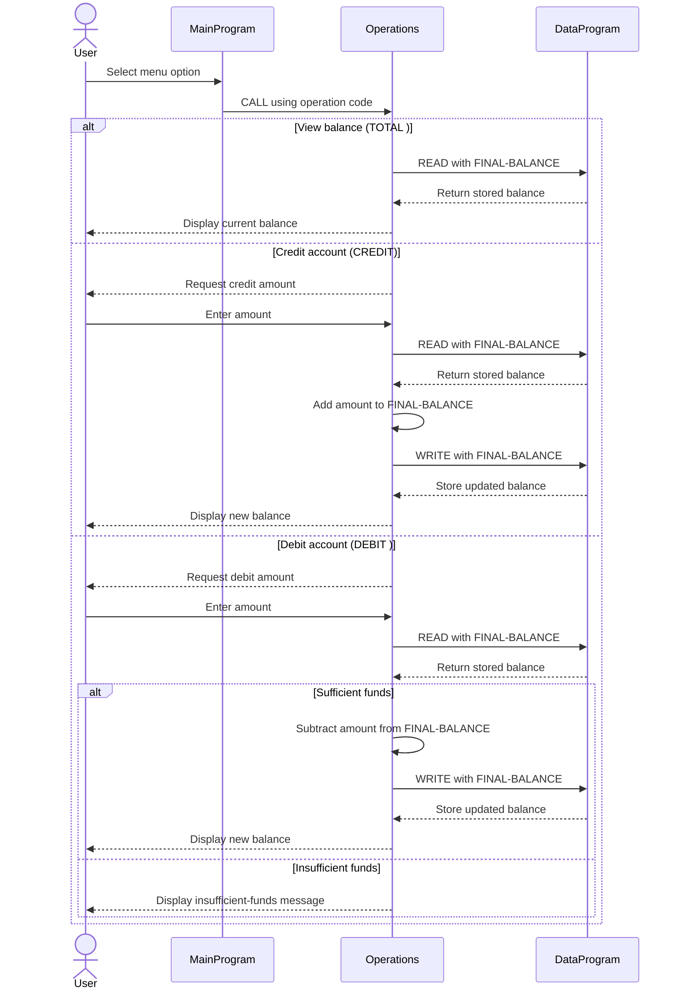

# Student Account COBOL Programs

This directory documents the COBOL account-management example in `src/cobol`. The application provides a console workflow for viewing a student account balance, adding funds, withdrawing funds, and exiting.

## Program Responsibilities

### `main.cob`

`MainProgram` is the user-facing entry point. It:

- Displays the account-management menu.
- Accepts a numeric choice from the user.
- Calls `Operations` with the requested operation.
- Repeats until the user selects Exit.
- Reports invalid menu choices without leaving the main loop.

Supported operation codes are `TOTAL ` for viewing the balance, `CREDIT` for adding funds, and `DEBIT ` for withdrawing funds. The operation codes are six characters wide, so trailing spaces are significant.

### `operations.cob`

`Operations` implements the account actions requested by the main program. It:

- Reads and displays the current balance for a total request.
- Prompts for an amount, reads the balance, and saves the updated balance for a credit.
- Prompts for an amount, checks available funds, and saves the reduced balance for a debit.
- Displays an insufficient-funds message when a debit is larger than the current balance.

The program passes the working balance to `DataProgram` for every read and write, keeping the account storage logic separate from transaction logic.

### `data.cob`

`DataProgram` owns the stored account balance. It accepts an operation code and a balance through its linkage section:

- `READ` copies the stored balance into the caller's balance field.
- `WRITE` replaces the stored balance with the caller's balance.

The initial stored balance is `1000.00`. The balance uses `PIC 9(6)V99`, representing up to six whole-number digits and two decimal places.

## Student Account Business Rules

The current implementation applies these rules:

1. Every account starts with a balance of `1000.00` when `DataProgram` is initialized.
2. A credit increases the balance by the amount entered by the user.
3. A debit is accepted only when the available balance is greater than or equal to the requested amount.
4. A debit that exceeds the available balance is rejected and does not update stored funds.
5. Viewing, crediting, and debiting all read the latest stored balance before acting.
6. A successful credit or debit writes the resulting balance back to `DataProgram`.

The source currently contains no student identifier, per-student records, authentication, transaction history, fees, overdraft rules, or validation for negative or malformed amounts. Those policies would need to be added before using this as a multi-student account system.

## Program Flow

```text
MainProgram
    |
    +-- TOTAL  --> Operations --> DataProgram READ  --> display balance
    +-- CREDIT --> Operations --> DataProgram READ  --> add amount
    |                         --> DataProgram WRITE --> display balance
    +-- DEBIT  --> Operations --> DataProgram READ  --> check funds
                              --> DataProgram WRITE --> display balance
```

## Application Sequence

